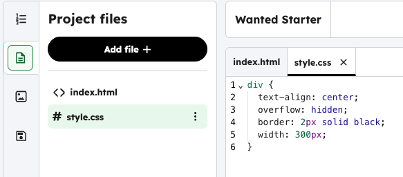
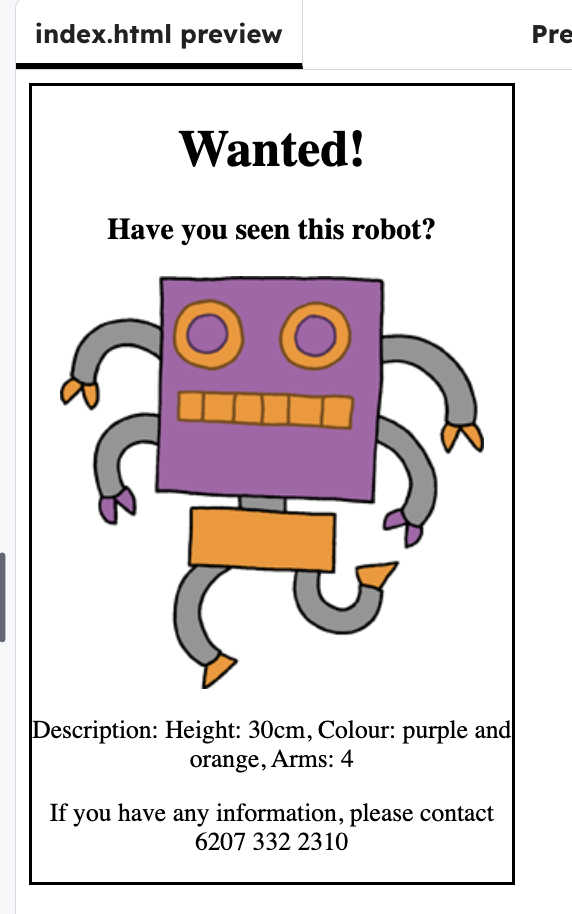

<h2 class="c-project-heading--task">Using CSS</h2>

### Step 1

Press the **Run** button to see what the starter page looks like.

### Step 2

Click on the file tab, and select **style.css**. 

### Step 3

Find `text-align` property and change the word `left` to `center` or `right`.

--- code ---
---
language: css
line_numbers: true
line_number_start: 1
line_highlights: 2
---
div {
  text-align: center;
  overflow: hidden;
  border: 2px solid black;
  width: 300px;
}
--- /code ---

### Step 4

Test: click **Run** button to see the text change.

