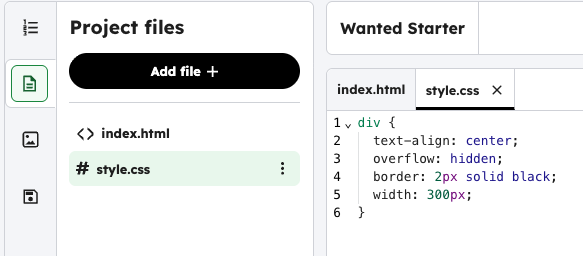
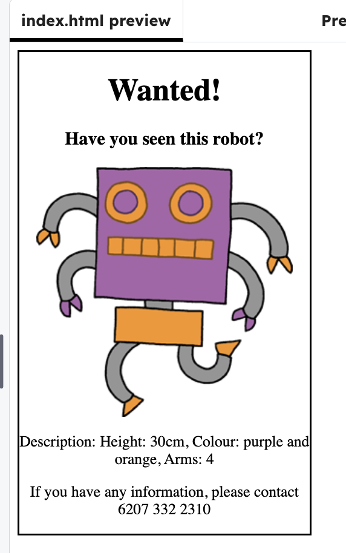

## Using CSS

Press the **Run** button to see what the starter page looks like.

## Step 1

Click on the file tab, and select **style.css**.



## Step 2

Find the `text-align` property and change the word `left` to `center` or `right`.

```css line_numbers="true" line_number_start="1" line_highlights="2"
div {
  text-align: center;
  overflow: hidden;
  border: 2px solid black;
  width: 300px;
}
```

## Now run your code

Click the **Run** button to see the text change.


