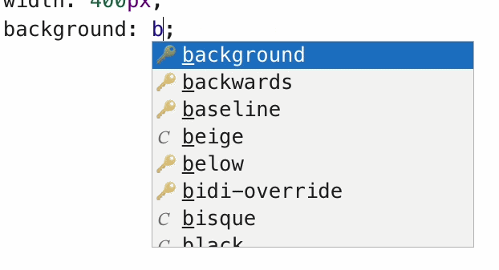
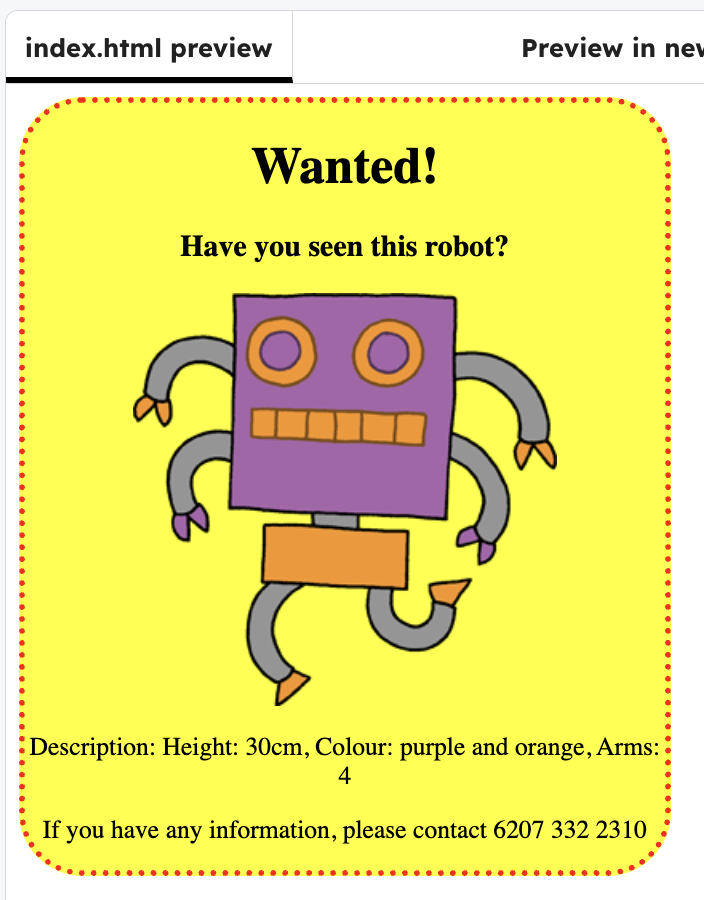

<h2 class="c-project-heading--task">Style the poster</h2>

### Step 1

Add more code in the css to style the poster.

### Tip

You can start typing in a new colour in the css and it will autocomplete with all relted colours.

### Step 2

Use the code below to change the design:

- Change the size, type and colour of the `border` 
- Curve the edge with `border-radius` 
- Edit the size the `width` 
- Choose a differnet `background` colour

--- code ---
---
language: css
line_numbers: true
line_number_start: 1
line_highlights: 4-7
---
div {
  text-align: center;
  overflow: hidden;
  border: 4px dotted red;
  border-radius: 40px;
  width: 400px;
  background: yellow;
}
--- /code ---

### Step 3

Test: click **Run** button to see the design change.

