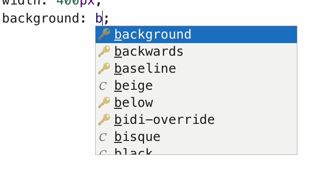
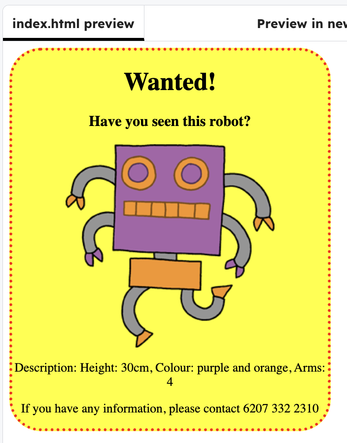

## Style the poster

Add more code in the CSS to style the poster.

> [!TIP]
>
> You can start typing in a new colour in the CSS and it will autocomplete with all related colours.
>
> 

Use the code below to change the design:

- Change the size, type, and colour of the `border`
- Curve the edge with `border-radius`
- Edit the size of the `width`
- Choose a different `background` colour

```css line_numbers="true" line_number_start="1" line_highlights="4-7"
div {
  text-align: center;
  overflow: hidden;
  border: 4px dotted red;
  border-radius: 40px;
  width: 400px;
  background: yellow;
}
```

## Now run your code

Click the **Run** button to see your design changes.


