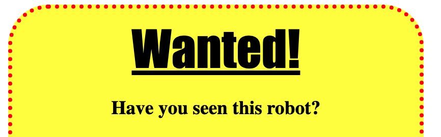

<h2 class="c-project-heading--task">Headings</h2>

### Step 1

Add another CSS style at the bottom of your file for `h1` which is a heading.

### Step 2

Add the code and experiment with your heading:

- Try adding other `font-family` names such as `Georgia`, `Times New Roman`, `Courier New`.
- Play with the `font-size` to get the look you want. 
- You could have `wavy underline` or `dotted underline` instead of the `underline`.

--- code ---
---
language: css
line_numbers: true
line_number_start: 10
line_highlights: 16-21
---
img {
	width: 100px;
  	border: 1px solid black;
  	padding: 10px;
}

h1 {
	font-family: Impact;
	font-size: 3em;
	margin: 10px;
	text-decoration: underline;
}
--- /code ---

### Step 3

Test: click **Run** button to see the heading changes.

